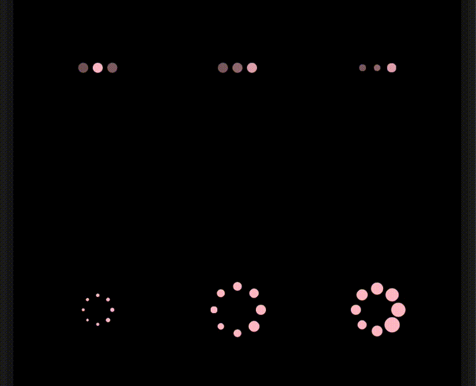

[](https://github.com/ken0x0a/react-native-reanimated-indicators/actions)
[](https://www.npmjs.com/package/react-native-reanimated-indicators)

Non JS thread blocking indicator components for React Native.

<p align="center">

</p>

<sup align="center">

The code for this example is [here](#example).

</sup>

---

- [Usage](#usage)
- [Components](#components)
  - [1. `<BallIndicator />`](#1-ballindicator-)
  - [2. `<DotIndicator />`](#2-dotindicator-)
- [Example](#example)
- [Status](#status)
- [Why I created this library](#why-i-created-this-library)

---

## Usage

```sh
yarn add react-native-reanimated-indicators
```


## Components

### 1. `<BallIndicator />`

Looks almost the same as the original.

```tsx
<BallIndicator color="orange" />
```

### 2. `<DotIndicator />`

Looks like the indicator at "Messages" at "mac os" or "iOS", but I couldn't create the same.

```tsx
<DotIndicator color="tomato" scaleEnabled={true} />
```

## Example

```tsx
import React from "react";
import { StyleSheet, Text, View } from "react-native";
import { BallIndicator, DotIndicator } from "react-native-reanimated-indicators";

export const IndicatorScreen: React.FC = () => {
  return (
    <View style={styles.container}>
      <Text>IndicatorScreen</Text>
      <View style={styles.ball}>
        <DotIndicator color="pink" interval={1400} />
        <DotIndicator color="pink" />
        <DotIndicator color="pink" scaleEnabled={true} />
      </View>
      <View style={styles.ball}>
        <BallIndicator color="pink" dotSize={4} size={30} />
        <BallIndicator color="pink" />
        <BallIndicator color="pink" dotSize={14} />
      </View>
    </View>
  );
};

const styles = StyleSheet.create({
  container: {
    flex: 1,
    backgroundColor: "black",
  },
  rect: {
    flex: 1,
    alignItems: "center",
    justifyContent: "center",
    flexDirection: "row",
  },
  ball: {
    flex: 1,
    flexDirection: "row",
  },
});
```

## Status

If anyone is interested in adding new indicators, I appreciate the PR 🙌

## Why I created this library

There is [an awesome indicators library (react-native-indicators)][react-native-indicators] from a long time ago.
But, as `Animated` from `react-native` contact with JS thread when animation is finished, it makes `InteractionManager.runAfterInteraction` never run...

I was using [the awesome library (react-native-indicators)][react-native-indicators], until use it with `InteractionManager.runAfterInteraction()`.

As `Animated` from `react-native` contact with JS thread when animation is finished, `InteractionManager.runAfterInteraction` never runs...
I didn't understand for a while, and I switch to `ActivityIndicator` at that moment.

After that,
I got to know [Can it be done in React Native?](https://www.youtube.com/user/wcandill/videos) and I started to think "CAN IT BE DONE? by using `react-native-reanimated`"


[react-native-indicators]: https://github.com/n4kz/react-native-indicators
